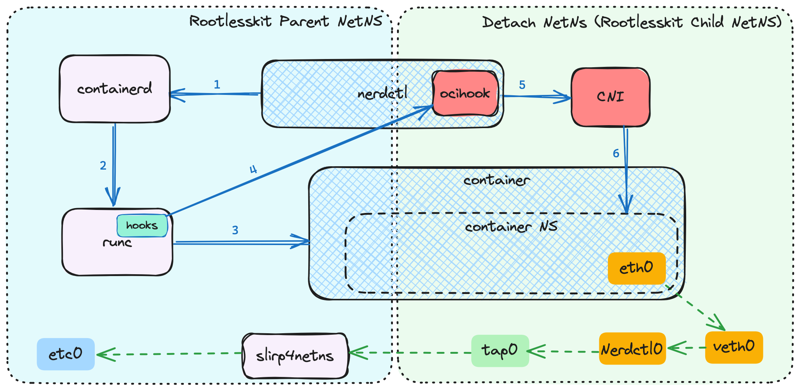

# Rootless mode

See https://rootlesscontaine.rs/getting-started/common/ for the prerequisites.

## Daemon (containerd)

Use [`containerd-rootless-systemd.sh`](../extras/rootless) to set up rootless containerd.

```console
$ containerd-rootless-systemd.sh install
[INFO] Checking RootlessKit functionality
[INFO] Checking cgroup v2
[INFO] Checking overlayfs
[INFO] Creating /home/testuser/.config/systemd/user/containerd.service
...
[INFO] Installed containerd.service successfully.
[INFO] To control containerd.service, run: `systemctl --user (start|stop|restart) containerd.service`
[INFO] To run containerd.service on system startup, run: `sudo loginctl enable-linger testuser`

[INFO] Use `nerdctl` to connect to the rootless containerd.
[INFO] You do NOT need to specify $CONTAINERD_ADDRESS explicitly.
```

The usage of `containerd-rootless-systemd.sh` is almost same as [`dockerd-rootless-setuptool.sh`](https://rootlesscontaine.rs/getting-started/docker/) .

Resource limitation flags such as `nerdctl run --memory` require systemd and cgroup v2: https://rootlesscontaine.rs/getting-started/common/cgroup2/

## Client (nerdctl)

Just execute `nerdctl`. No need to specify the socket address manually.

```console
$ nerdctl run -it --rm alpine
```

Depending on your kernel version, you may need to enable FUSE-OverlayFS or set `export CONTAINERD_SNAPSHOTTER=native`.
(See below.)

## Add-ons
### BuildKit
To enable BuildKit, run the following command:

```console
$ containerd-rootless-systemd.sh install-buildkit
```

## Snapshotters

### OverlayFS

The default `overlayfs` snapshotter only works on the following hosts:
- Any distro, with kernel >= 5.13
- Non-SELinux distro, with kernel >= 5.11
- Ubuntu since 2015

For other hosts, [`fuse-overlayfs` snapshotter](https://github.com/containerd/fuse-overlayfs-snapshotter) needs to be used instead.

### FUSE-OverlayFS

To enable `fuse-overlayfs` snapshotter, run the following command:
```console
$ containerd-rootless-systemd.sh install-fuse-overlayfs
```

Then, add the following config to `~/.config/containerd/config.toml`, and run `systemctl --user restart containerd.service`:
```toml
[proxy_plugins]
  [proxy_plugins."fuse-overlayfs"]
      type = "snapshot"
# NOTE: replace "1000" with your actual UID
      address = "/run/user/1000/containerd-fuse-overlayfs.sock"
```

The snapshotter can be specified as `$CONTAINERD_SNAPSHOTTER`.
```console
$ export CONTAINERD_SNAPSHOTTER=fuse-overlayfs
$ nerdctl run -it --rm alpine
```

If `fuse-overlayfs` does not work, try `export CONTAINERD_SNAPSHOTTER=native`.

### Stargz Snapshotter
[Stargz Snapshotter](./stargz.md) enables lazy-pulling of images.

To enable Stargz snapshotter, run the following command:
```console
$ containerd-rootless-systemd.sh install-stargz
```

Then, add the following config to `~/.config/containerd/config.toml` and run `systemctl --user restart containerd.service`:
```toml
[proxy_plugins]
  [proxy_plugins."stargz"]
      type = "snapshot"
# NOTE: replace "1000" with your actual UID
      address = "/run/user/1000/containerd-stargz-grpc/containerd-stargz-grpc.sock"
```

The snapshotter can be specified as `$CONTAINERD_SNAPSHOTTER`.
```console
$ export CONTAINERD_SNAPSHOTTER=stargz
$ nerdctl run -it --rm ghcr.io/stargz-containers/alpine:3.10.2-esgz
```

See https://github.com/containerd/stargz-snapshotter/blob/main/docs/pre-converted-images.md for the image list.

## bypass4netns
| :zap: Requirement | nerdctl >= 0.17 |
|-------------------|-----------------|


[bypass4netns](https://github.com/rootless-containers/bypass4netns) is an accelerator for rootless networking.

This improves **outgoing or incoming (with --publish option) networking performance.**

The performance benchmark with iperf3 on Ubuntu 21.10 on Hyper-V VM is shown below.
| iperf3 benchmark  | without bypass4netns | with bypass4netns |
| ----------------- | -------------------- | ----------------- |
| container -> host | 0.398 Gbps           | **42.2 Gbps**         |
| host -> container | 20.6 Gbps             | **47.4 Gbps**         |

This benchmark can be reproduced with [https://github.com/rootless-containers/bypass4netns/blob/f009d96139e9e38ce69a2ea8a9a746349bad273c/Vagrantfile](https://github.com/rootless-containers/bypass4netns/blob/f009d96139e9e38ce69a2ea8a9a746349bad273c/Vagrantfile)

Acceleration with bypass4netns is available with:
- `--annotation nerdctl/bypass4netns=true` (for nerdctl v2.0 and later)
- `--label nerdctl/bypass4netns=true` (deprecated form, used in nerdctl prior to v2.0).

You also need to have `bypass4netnsd` (bypass4netns daemon) to be running.
Example
```console
$ containerd-rootless-systemd.sh install-bypass4netnsd
$ nerdctl run -it --rm -p 8080:80 --annotation nerdctl/bypass4netns=true alpine
```

More detail is available at [https://github.com/rootless-containers/bypass4netns/blob/master/README.md](https://github.com/rootless-containers/bypass4netns/blob/master/README.md)

## Configuring RootlessKit

Rootless containerd recognizes the following environment variables to configure the behavior of [RootlessKit](https://github.com/rootless-containers/rootlesskit):

* `CONTAINERD_ROOTLESS_ROOTLESSKIT_STATE_DIR=DIR`: the rootlesskit state dir. Defaults to `$XDG_RUNTIME_DIR/containerd-rootless`.
* `CONTAINERD_ROOTLESS_ROOTLESSKIT_NET=(slirp4netns|vpnkit|lxc-user-nic)`: the rootlesskit network driver. Defaults to "slirp4netns" if slirp4netns (>= v0.4.0) is installed. Otherwise defaults to "vpnkit".
* `CONTAINERD_ROOTLESS_ROOTLESSKIT_MTU=NUM`: the MTU value for the rootlesskit network driver. Defaults to 65520 for slirp4netns, 1500 for other drivers.
* `CONTAINERD_ROOTLESS_ROOTLESSKIT_PORT_DRIVER=(builtin|slirp4netns)`: the rootlesskit port driver. Defaults to "builtin".
* `CONTAINERD_ROOTLESS_ROOTLESSKIT_SLIRP4NETNS_SANDBOX=(auto|true|false)`: whether to protect slirp4netns with a dedicated mount namespace. Defaults to "auto".
* `CONTAINERD_ROOTLESS_ROOTLESSKIT_SLIRP4NETNS_SECCOMP=(auto|true|false)`: whether to protect slirp4netns with seccomp. Defaults to "auto".
* `CONTAINERD_ROOTLESS_ROOTLESSKIT_DETACH_NETNS=(auto|true|false)`: whether to launch rootlesskit with the "detach-netns" mode.
  Defaults to "auto", which is resolved to "true" if RootlessKit >= 2.0 is installed.
  The "detached-netns" mode accelerates `nerdctl (pull|push|build)` and enables `nerdctl run --net=host`,
  however, there is a relatively minor drawback with BuildKit prior to v0.13:
  the host loopback IP address (127.0.0.1) and abstract sockets are exposed to Dockerfile's "RUN" instructions during `nerdctl build` (not `nerdctl run`).
  The drawback is fixed in BuildKit v0.13. Upgrading from a prior version of BuildKit needs removing the old systemd unit:
  `containerd-rootless-systemd.sh uninstall-buildkit && rm -f ~/.config/buildkit/buildkitd.toml`

To set these variables, create `~/.config/systemd/user/containerd.service.d/override.conf` as follows:
```ini
[Service]
Environment=CONTAINERD_ROOTLESS_ROOTLESSKIT_DETACH_NETNS="false"
```

And then run the following commands:
```bash
systemctl --user daemon-reload
systemctl --user restart containerd
```

## Troubleshooting

### Hint to Fedora users
- If SELinux is enabled on your host and your kernel is older than 5.13, you need to use [`fuse-overlayfs` instead of `overlayfs`](#fuse-overlayfs).

## Rootlesskit Network Design

In `detach-netns` mode:

- Network namespace is detached and stored in `$ROOTLESSKIT_STATE_DIR/netns`.
- The child command executes within the host's network namespace, allowing actions like `pull` and `push` to happen in the host network namespace.
- For creating and configuring the container's network namespace, the child command switches temporarily to the relevant namespace located in `$ROOTLESSKIT_STATE_DIR/netns`. This ensures necessary network setup while maintaining isolation in the host namespace.



- Rootlesskit Parent NetNS and Child NetNS are already configured by the startup script [containerd-rootless.sh](https://github.com/containerd/nerdctl/blob/main/extras/rootless/containerd-rootless.sh)
- Rootlesskit Parent NetNS is the host network namespace
- step1: `nerdctl` calls `containerd` in the host network namespace.
- step2: `containerd` calls `runc` in the host network namespace.
- step3: `runc` creates container with dedicated namespaces (e.g network ns) in the Parent netns.
- step4: `runc` nsenter Rootlesskit Child NetNS before triggering nerdctl ocihook.
- step5: `nerdctl` ocihook module leverages CNI.
- step6: CNI configures container network namespace: create network interfaces `eth0` -> `veth0` -> `nerdctl0`.
